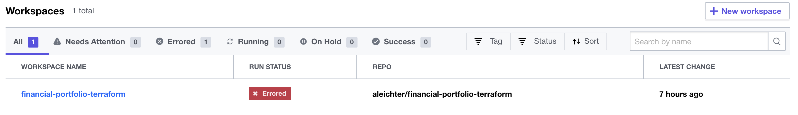
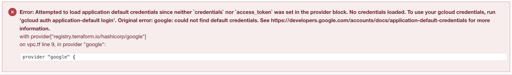
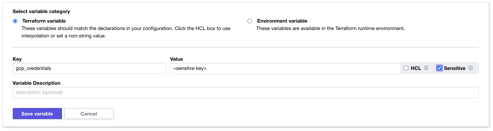
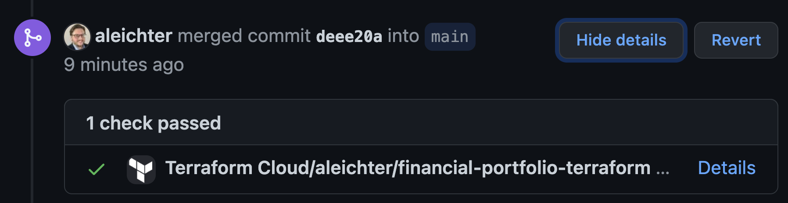
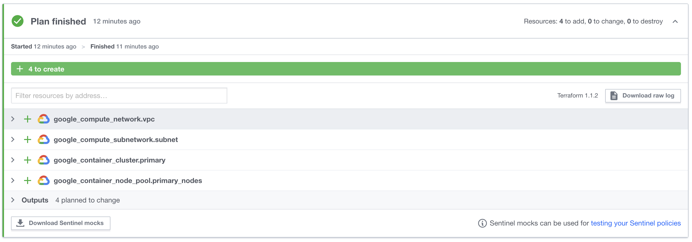
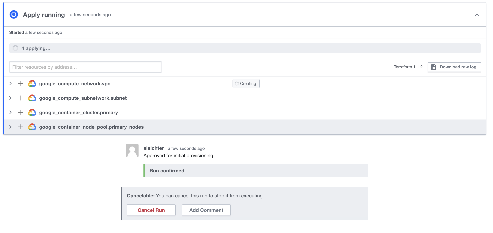
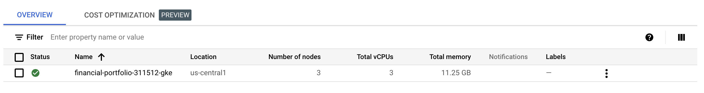
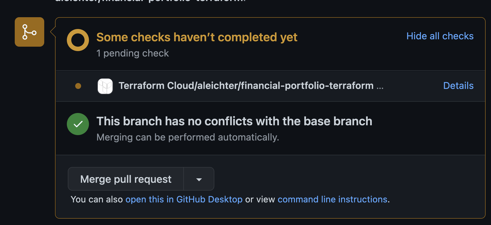
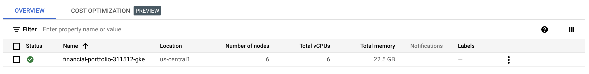

## Terraform Cloud and Github

I have worked my way though a simple gcloud tutorial to spin up a simple GKE cluster and I have created a free account on Terraform Cloud.  For immutable infrastructure management Terraform Cloud will use webhooks from github to create a speculative plan for each pull request and apply the plan for each merge.  So the integration of Terraform Cloud and Github will be the gitops infrastructure for my Infrastructure-As-Code (IAC) implementation.

## Terraform Cloud Setup
I have now created a free personal account and configured a workspace to my financial-portfolio-terraform repo:
](../images/terraform-workspace.png)
You can see from the above screenshot that I already have an error.  I selected from the Action menu "Start new plan".  I got the following error:

This should have been obvious. I have not provided Terraform nor the HCL scripts anyway to authenticate to my GCP account and project.  It worked locally because I had configured an authenticated my local gcloud SDK with credentials.  Terraform Cloud runs in the Terraform infrastructure with a gcloud SDK that has not been authenticated so I need to provide those credentials in my scripts.

## GCP Service Account
The first step is create a service account in my GCP account for terraform to have access to my financial-portfolio project.  I created this account with Owner which is a bad idea in production setup but works to get through this exercise.  I then created a new JSON Key and downloaded the key to my computer.  I've minified the json for use in HCL.

## Add Credentials to HCL
The next step was to add credentials to the HCL scripts and commit those changes to the terraform github repo.  As you can see below, I added a gcp_credentials variable and updated the google provider to include the credentials:
```terraform
variable "gcp_credentials" {
  type = string
  sensitive = true
  description = "Google Cloud service account credentials"
}

provider "google" {
  project = var.project_id
  region  = var.region
  credentials = var.gcp_credentials
}
```

The key to making this work securely is storing the credential in the Terraform Cloud workspace via a "sensitive" variable like so:


## Create a pull request
Once I made these changes, I committed them via a branch I created off of main.  I then created a pull request to merge back to main.  Once I did that github notified and provided me a link back to Terraform Cloud where I could review the speculative plan created automatically by the pull request.

The "details" link takes you to Terraform Cloud where you can review the plan.  This happens as part of CI integration provided by the github integration.

How cool is that!?!

Once I approved and completed the pull request by merging the code the gitops integration automatically creates an apply task in Terraform. This can be configured to happen automatically but I have it configured to require human intervention so I have to click the "Confirm & Apply" button.

Once clicked you can watch the plan apply...


## GKE is provisioned
Now my GKE environment is automatically provisioned to my GCP project and I can start working on the next steps of automating the application deployment to the GKE cluster via some other gitops tools.

Notice that the cluster has 3 nodes.  One node for each zone in the region.  I'm going to make a minor change to the HCL and update to 2 nodes for each regions.  so it will end up with 6 nodes in total.

HCL Change:
```terraform
variable "gke_num_nodes" {
  default     = 2
  description = "number of gke nodes"
}
```
Commit and push the code for a new branch and then create a pull request. Which will automatically execute the CI hooks and create a speculative plan:

You can see the plan is currently being built but once it's done it will go green in github and the plan will show up in Terraform Cloud

Pull request gets merged and branch deleted which will give me the "Confirm & Apply" button. Once that completes, the GKE cluster will now automatically have 6 nodes instead of 3.


Of course, this is not how you would do it in production.  If you already know Terraform you would know this change would actually destroy the existing cluster and rebuild it.  Clearly in a production cluster you would write a script that just adds new nodes.  This is, however, an example of immutable infrastructure and it's power to make changes automatically and with no manual changes to the servers themselves.